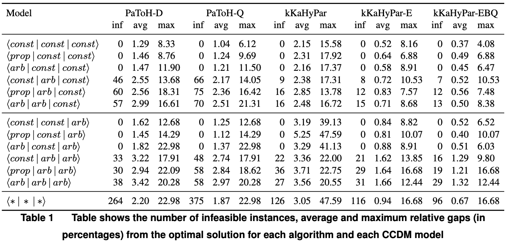
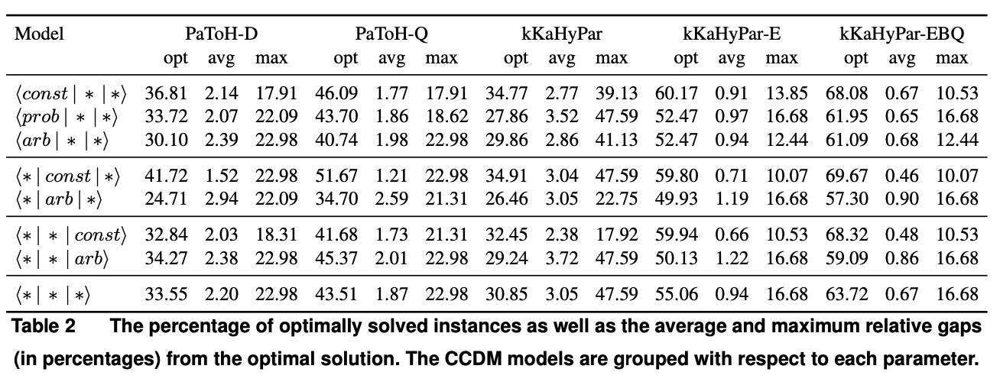
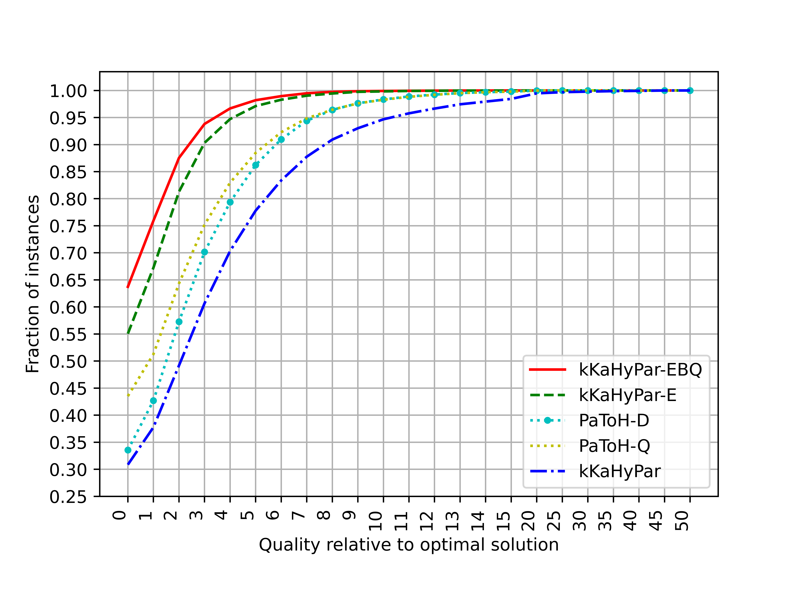
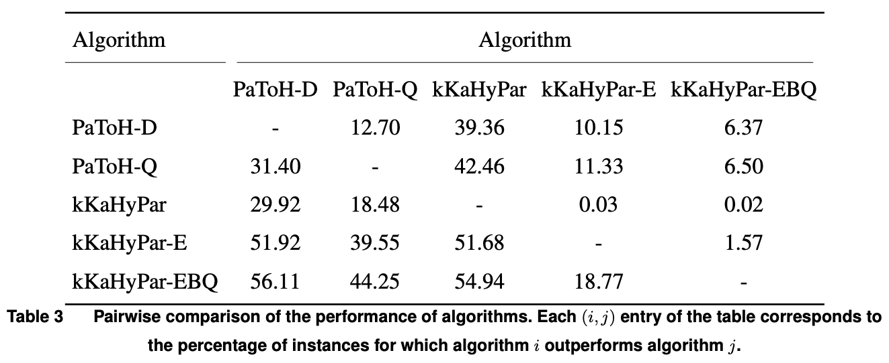
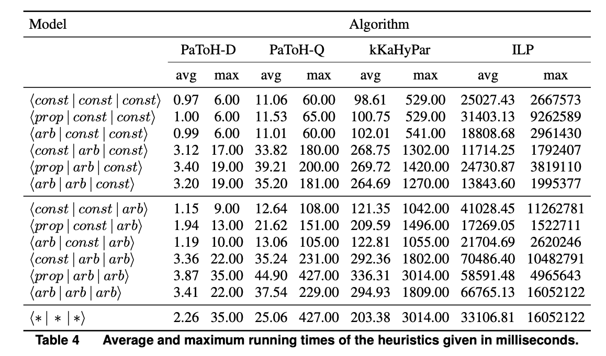

[](https://pubsonline.informs.org/journal/ijoc)

# Models for test cost minimization in database migration

This archive is distributed in association with the [INFORMS Journal on
Computing](https://pubsonline.informs.org/journal/ijoc) under the [MIT License](LICENSE).

The software and data in this repository are a snapshot of the software and data
that were used in the research reported on in the paper 
[Models for test cost minimization in database migration](https://doi.org/10.1287/ijoc.2019.0000) by B. Caskurlu, K. Submrani, U.U. Acikalin, A. Velasquez and P. Wojciechowski. 

The repository contains implementations of adaptions of the heuristic algorithms and the ILP used in the paper as well as the benchmark instances used to produce this paper.

## Cite

To cite the contents of this repository, please cite both the paper and this repo, using their respective DOIs.

https://doi.org/10.1287/ijoc.2023.0021

https://doi.org/10.1287/ijoc.2023.0021.cd

Below is the BibTex for citing this snapshot of the repository.

```
@article{testCostMinimization,
  author =        {B. Caskurlu, K. Submrani, U.U. Acikalin, A. Velasquez and P. Wojciechowski},
  publisher =     {INFORMS Journal on Computing},
  title =         {{Models for test cost minimization in database migration}},
  year =          {2023},
  doi =           {10.1287/ijoc.2023.0021.cd},
  url =           {https://github.com/INFORMSJoC/2023.0021},
}  
```


## Results

Table 1 in the paper shows the number of infeasible instances, average and maximum relative gaps (in
percentages) from the optimal solution for each algorithm and each CCDM model.




Table 2 in the paper aggregates the results in Table 1 for various parameters to offer a more compact view for analyzing the performance of the heuristic algorithms with respect to the parameters of the model.




Figure 3 in the paper displays a performance plot that contrasts
the outcomes of heuristic algorithms with their corresponding optimal solutions on an instance-
by-instance basis.



Table 3 in the paper displays the results of a head-to-head comparison of the algorithms on all the instances. Each entry (i,j) in the table represents the percentage of instances in which algorithm i outperformed algorithm j. For example, the last column of the first row indicates that in 6.37% of the instances, PaToH-D produced better solutions than kKaHyPar-EBQ.



Table 4 in the paper shows the running time of the algorithms in



## Replicating

To replicate the tables and the figure, do

```
python codes/results/results.py
```
This script reads the results and produces the tables and the figures.

To run the algorithms from scratch check the corresponding folders inside the codes folder. After re-running the algorithms, you can use the command above to replicate the tables and the figure using the results of these new runs.